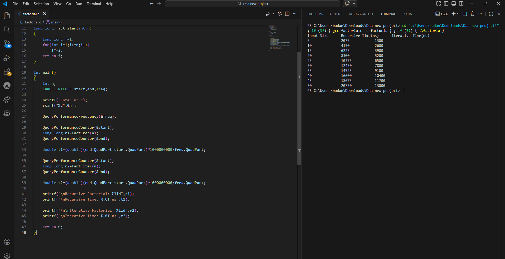
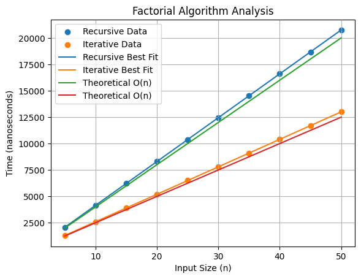

# Factorial Analysis – DAA Lab

## Objective

To implement factorial computation using recursive and non-recursive algorithms and analyze their running time.

---

## Algorithm Description

### Recursive Factorial

Recursive implementation follows the mathematical definition.

F(n) = n × F(n-1)

Base case:

F(0) = 1

---

### Iterative Factorial

The factorial is computed using a loop that multiplies numbers from 1 to n.

Algorithm steps:

1. Initialize result = 1
2. Multiply numbers from 1 to n
3. Return result

---

## Formula

n! = n × (n-1) × (n-2) × ... × 1

---

## Time Complexity

| Algorithm | Complexity |
|---|---|
| Recursive Factorial | O(n) |
| Iterative Factorial | O(n) |

Both algorithms grow linearly with input size.

---

## Program Output

Execution results of factorial programs.

---

## Graph

Graph showing running time vs input size.

---

## Observation

Both recursive and iterative algorithms have linear time complexity O(n).

However, recursive factorial is slightly slower because of function call overhead and stack usage.

Iterative factorial performs better because it uses simple looping without recursive calls.

Therefore, iterative implementation is generally preferred for performance.
