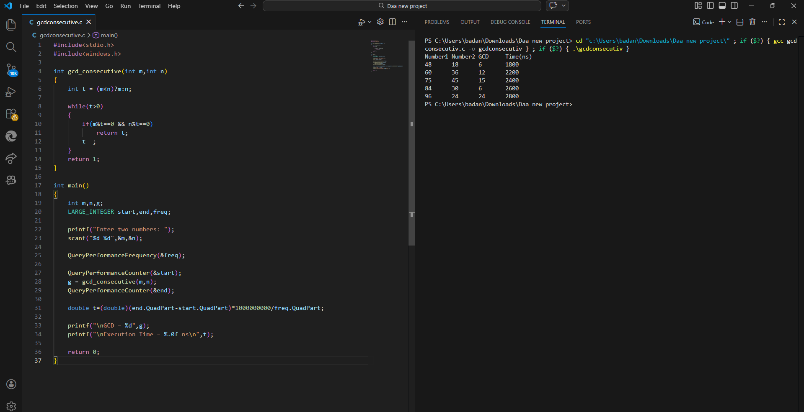

# GCD using Consecutive Integer Checking Algorithm

## Objective

To compute the Greatest Common Divisor (GCD) of two numbers using the Consecutive Integer Checking Algorithm.

---

## Algorithm Description

The algorithm checks integers starting from the minimum of the two numbers and decreases the value until it finds a number that divides both numbers.

Steps:

1. Let t = min(m,n)
2. Check if m % t == 0 and n % t == 0
3. If yes → t is the GCD
4. Otherwise decrease t by 1
5. Repeat until divisor is found

---

## Time Complexity

| Case | Complexity |
|-----|------------|
| Best Case | O(1) |
| Worst Case | O(min(m,n)) |

---

## Program Output

---

## Observation

The Consecutive Integer Checking algorithm works by testing divisors sequentially from the minimum of the two numbers.

If the numbers have a large common divisor, the algorithm terminates quickly. Otherwise it may check many integers, making the worst case linear in the size of the smaller number.

This method is simple but inefficient compared to Euclid’s Algorithm, which solves the same problem in logarithmic time.
