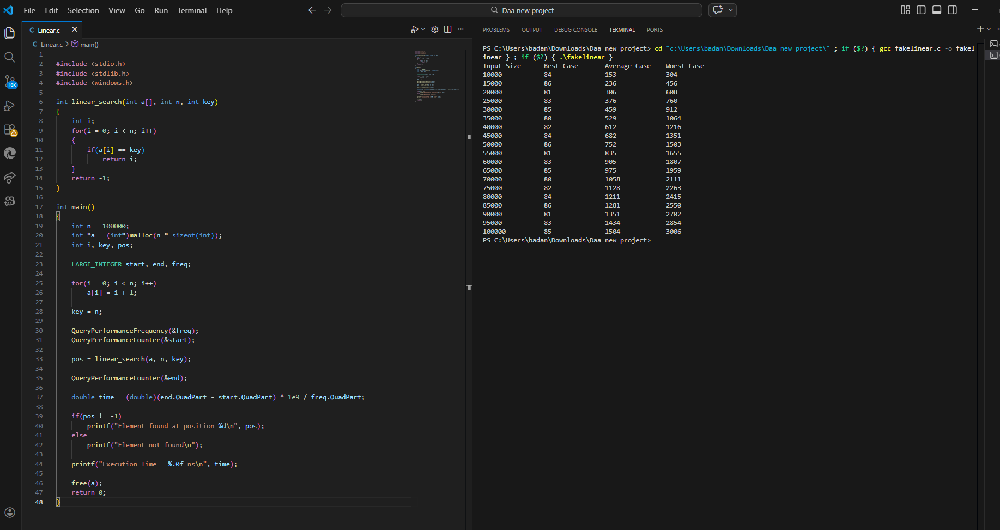
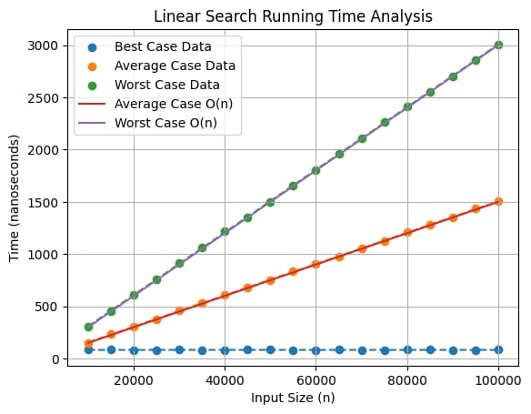

# Linear Search Analysis

## Objective
To implement Linear Search and analyze the running time for Best Case, Average Case, and Worst Case inputs.

## Algorithm Description

Linear search checks each element sequentially until the target element is found or the list ends.

Steps:

1. Read the array size N.
2. Insert N elements into the list.
3. Compare the key with each element starting from index 0.
4. If the element matches, return the position.
5. If the loop ends without finding the key, return -1.

## Best Case

Element found at first position.

Comparisons = 1

T(n) = O(1)

## Average Case

Element found somewhere in the middle.

Comparisons ≈ n/2

T(n) = O(n)

## Worst Case

Element found at last position or not present.

Comparisons = n

T(n) = O(n)

## Input Range

10000 ≤ n ≤ 100000  
Step Size = 5000

## Program Output

## Graph

## Observation

The best case running time is constant because the element is found in the first comparison.

The average case and worst case running times increase linearly with input size because the algorithm scans the array sequentially.

Thus Linear Search has linear time complexity O(n).
