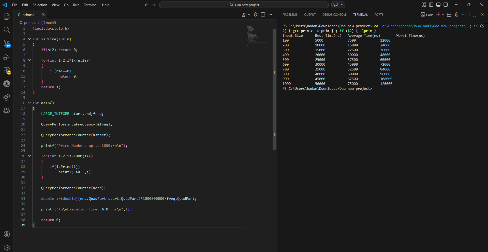

# Generate Prime Numbers – DAA Lab

## Objective

To generate prime numbers up to 1000 and analyze the running time of the algorithm.

---

## Algorithm Description

A number is prime if it is divisible only by 1 and itself.

Algorithm steps:

1. Start from number 2
2. For each number check divisibility from 2 to √n
3. If no divisor exists → number is prime
4. Print the number
5. Continue until 1000

---

## Time Complexity

| Case | Complexity |
|-----|------------|
| Best Case | O(n) |
| Worst Case | O(n√n) |

Each number is checked for divisibility up to √n.

---

## Program Output

---

## Observation

Prime number generation involves checking divisibility for each number.

As the input size increases, the number of divisibility checks increases roughly proportional to √n for each number.

Therefore the approximate complexity becomes O(n√n).

The program successfully generates all **168 prime numbers up to 1000**.

---
