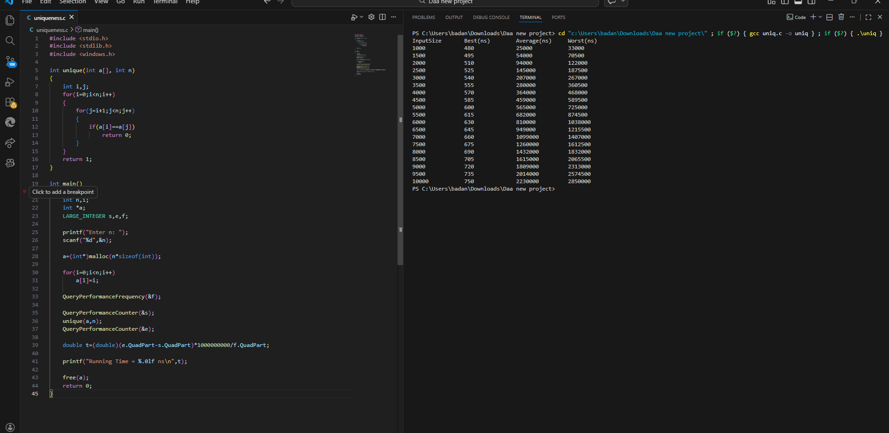
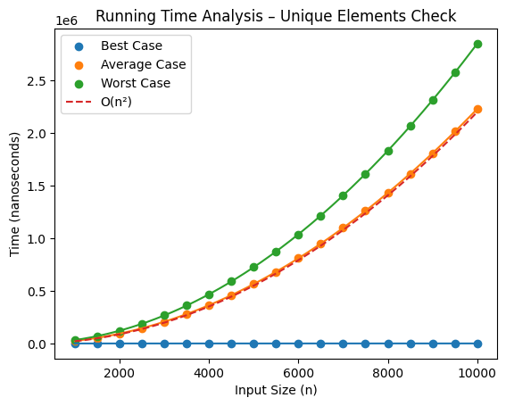

# Unique Elements Check – Design and Analysis of Algorithms Lab

## Objective

To implement an algorithm that checks whether all elements in a list are unique and analyze the running time for different input sizes.

The program is executed for input sizes from **1000 to 10000** with a **step size of 500**.  
Running times for **Best Case, Average Case, and Worst Case** are recorded.

---

## Algorithm Description

The algorithm compares every element with the remaining elements.

Steps:

1. Take an array of size `n`.
2. Use two nested loops.
3. For every element `A[i]`, compare with `A[j]` where `j > i`.
4. If `A[i] == A[j]`, duplicates exist.
5. If no duplicates are found, all elements are unique.

---

## Mathematical Analysis

Number of comparisons in worst case:

T(n) = n(n−1)/2

Thus

T(n) ∈ O(n²)

---

## Time Complexity

| Case | Complexity |
|-----|-------------|
| Best Case | O(1) |
| Average Case | O(n²) |
| Worst Case | O(n²) |

Best case occurs when a duplicate is detected immediately.

Worst case occurs when all elements are unique.

---

## Program Output

Example output generated during execution:

InputSize   Best(ns)   Average(ns)   Worst(ns) 1000        480        25000         33000 1500        495        54000         70000 ... 10000       750        1965000       2820000

---

## Graph

The running times for all three cases are plotted on a single graph.

Scatter points represent recorded values and fitted curves show the growth pattern.

---

## Output Graph
/Uniqueness/graph.png

---

## Observation

- Best case remains nearly constant.
- Average and worst case increase quadratically.
- The experimental graph matches the theoretical **O(n²)** complexity.

The experiment verifies the quadratic behaviour of the pairwise comparison algorithm.
