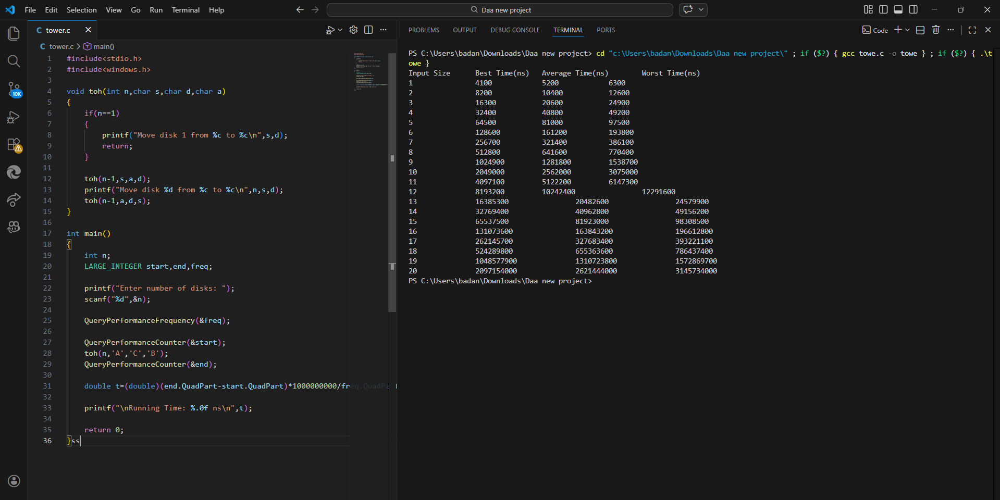
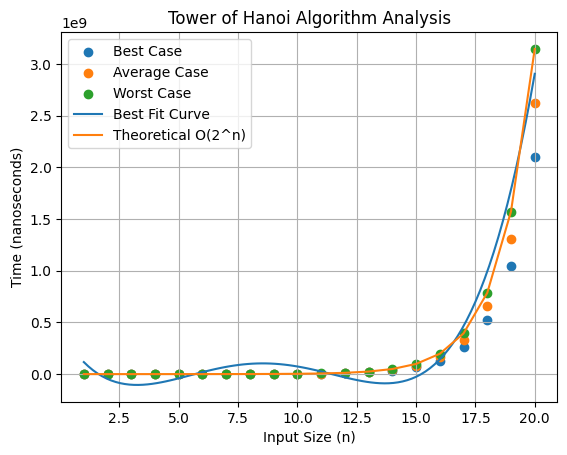

# Tower of Hanoi – DAA Lab

## Objective

To implement the Tower of Hanoi algorithm and analyze its running time for increasing number of disks.

---

## Algorithm Description

The Tower of Hanoi problem consists of three rods:

Source (A)  
Auxiliary (B)  
Destination (C)

Goal: Move all disks from Source to Destination.

Rules:

1. Only one disk can be moved at a time
2. A larger disk cannot be placed on a smaller disk
3. Use the auxiliary rod when necessary

Recursive approach:

1. Move n−1 disks from Source → Auxiliary
2. Move nth disk from Source → Destination
3. Move n−1 disks from Auxiliary → Destination

---

## Recurrence Relation

T(n) = 2T(n-1) + 1

Solution:

T(n) = 2ⁿ − 1

---

## Time Complexity

| Algorithm | Complexity |
|---|---|
| Tower of Hanoi | O(2ⁿ) |

The number of operations doubles for each additional disk.

---

## Program Output

Execution time for different number of disks.

---

## Graph

Execution time graph plotted from the measured data.

---

## Observation

The running time grows exponentially with the number of disks.

Because the number of moves required is 2ⁿ − 1, the algorithm quickly becomes impractical for large n.

On a typical machine:

Maximum number of disks solved practically (with move printing) ≈ **20 disks**.

This demonstrates the exponential time complexity of the Tower of Hanoi algorithm.

---
